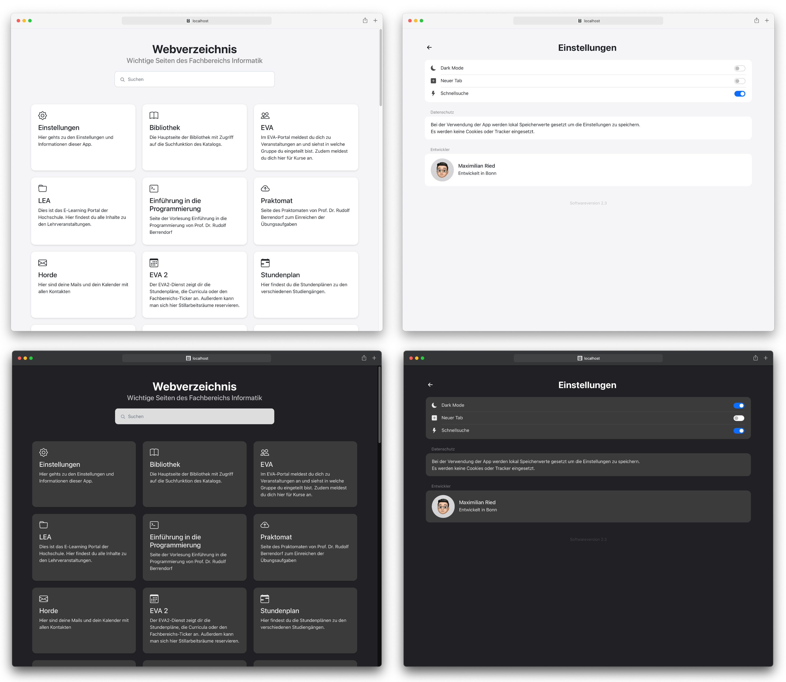

# Searchable web directory

## Description
I created this application to easily search for all the important websites at my university without having to bookmark every single page.  
The application features a settings menu with options for...

* Setting dark or light mode
* Creating a new when a card is clicked
* Quick search automatically selects the input field

When a card is clicked the app will redirect to the desired page.
Depending on the settings the page will be load in the same tab or in a new tab.

## Technologies
This Project uses the ReactJS Framework and Bootstrap for the CSS.  
Boostrap-Icons are used for the cards and the settings menu.  
Using the app will create locally stored variables to save the settings.

## Preview

## Available Scripts

### `npm start`
Runs the app in the development mode.\
Open [http://localhost:3000](http://localhost:3000) to view it in the browser.

The page will reload if you make edits.\
You will also see any lint errors in the console.

### `npm test`
Launches the test runner in the interactive watch mode.\
See the section about [running tests](https://facebook.github.io/create-react-app/docs/running-tests) for more information.

### `npm run build`
Builds the app for production to the `build` folder.\
It correctly bundles React in production mode and optimizes the build for the best performance.

The build is minified and the filenames include the hashes.\
Your app is ready to be deployed!

See the section about [deployment](https://facebook.github.io/create-react-app/docs/deployment) for more information.
